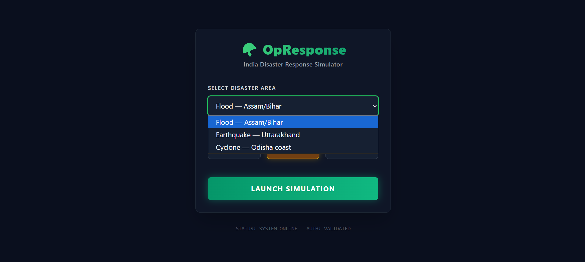
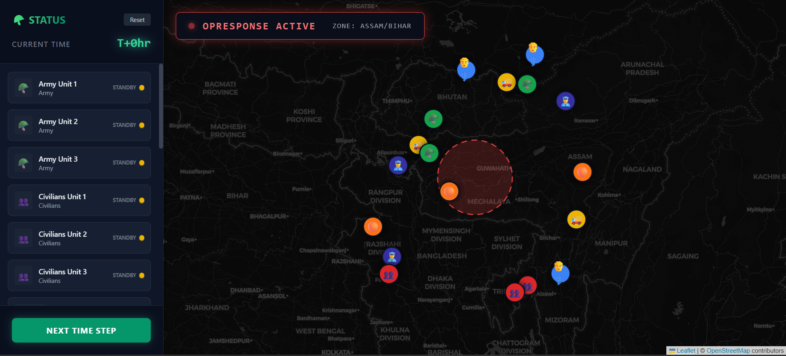
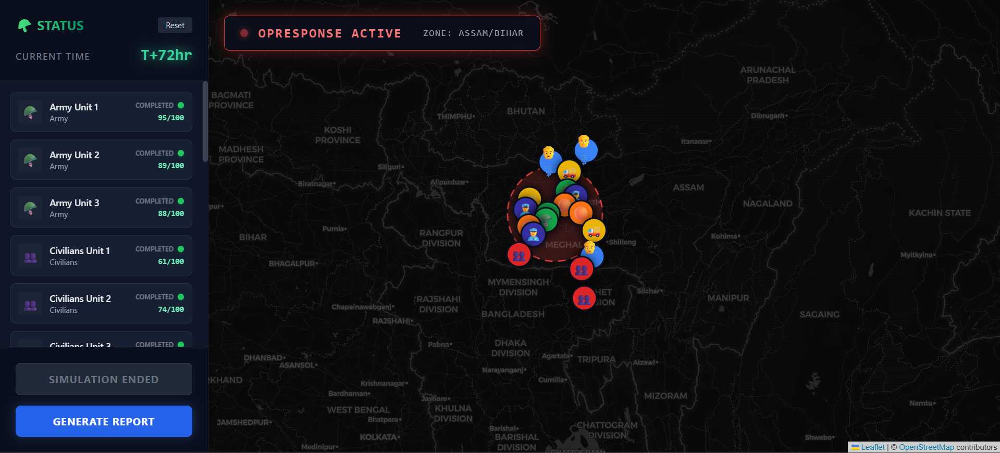
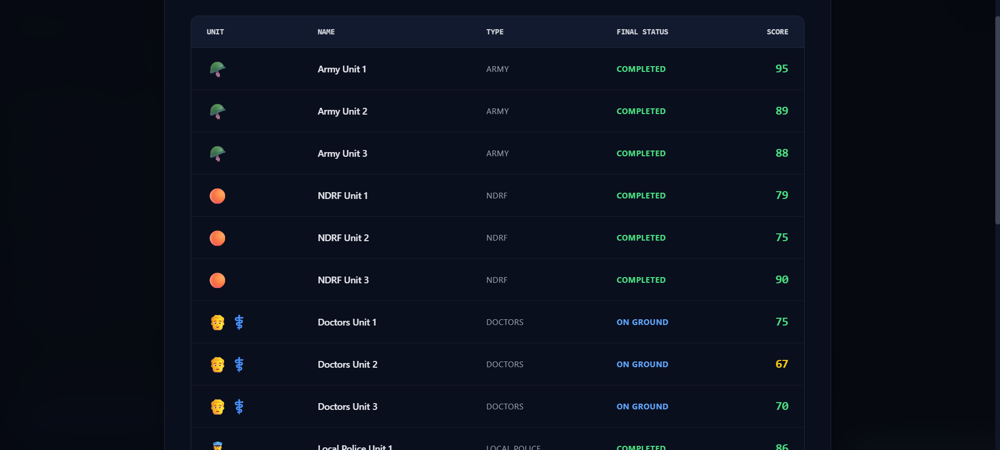

# 🪖 OpResponse — India Disaster Response Simulator

> A multi-theatre disaster response simulation platform built for India. Spawn agencies, model weather, compare strategies, and generate military-grade after-action reports — all in the browser.



---

## 🌐 Live Demo

👉 **[bharat-sim-defence.vercel.app](https://bharat-sim-defence-1ux11wutf-mr-einstein-x9s-projects.vercel.app)**

---

## 🎯 Problem Statement

India is among the world's most disaster-prone nations — floods in Assam, earthquakes in Uttarakhand, and cyclones along the Odisha coast occur every year. Despite this, disaster response planning largely happens on paper, with no way to:

- Visualize how multiple agencies coordinate in real time
- Predict bottlenecks before they happen — blocked supply chains, delayed medical deployment
- Score and evaluate response effectiveness after an operation
- Compare two response strategies before committing real resources

**OpResponse** bridges this gap by simulating disaster response scenarios on a real map of India — before resources are ever deployed.

---

## 💡 Inspiration

Inspired by **MiroFish** — a Chinese open-source agentic AI that seeds thousands of AI agents with real-world data to simulate and predict outcomes. OpResponse adapts this concept specifically for **India's disaster response and civil-military coordination problem**.

---

## ⚙️ Core Features

### 🗺️ Real India Map
Powered by Leaflet.js and OpenStreetMap — no API key required. Disaster zones rendered as color-coded impact circles with agent markers showing live status.

### 👥 6 Agency Types — 18 Agents
| Agent | Role | Color |
|---|---|---|
| 🪖 Army | Primary rescue, heavy logistics | Green |
| 🟠 NDRF | First responder, coordination | Orange |
| 👨‍⚕️ Doctors | Medical camps, civilian care | Blue |
| 👮 Local Police | Crowd control, ground intel | Navy |
| 🚚 Supply Chain | Food, water, medicine delivery | Yellow |
| 👥 Civilians | Affected population | Red |

### ⏱️ 4 Time Steps
T+0hr → T+6hr → T+24hr → T+72hr with realistic movement and status logic per agency type.

### 📊 After-Action Report
Military-style debrief with effectiveness scores, coordination breakdown, weather impact analysis, population risk assessment, and strategic recommendations.

---

## 🚀 Upgrades

### Upgrade 1 — Real District Population Data
- Real Indian census data for 15 districts across 3 disaster zones
- Civilian scores dynamically adjusted based on population at risk
- Flood in Assam (high density) is significantly harder to score well on than Earthquake in Uttarakhand
- Report shows affected districts table + total population in Lakhs
- Sidebar displays live "⚠️ Population at Risk" indicator

### Upgrade 2 — Weather Layer
- Disaster-specific weather conditions with real penalties per agency
- Flood: Heavy Rainfall — supply chains take -20 penalty
- Earthquake: Dust & Aftershocks — mountain roads collapsed, -25 supply penalty
- Cyclone: 120 km/h winds — aerial operations impossible, -30 supply penalty
- Weather preview on setup screen before launching simulation
- Collapsible weather panel in sidebar during simulation
- Weather impact section in after-action report

### Upgrade 3 — Multi-Theatre Operations
- Run up to **3 simultaneous disaster zones** in one simulation
- Smart severity-based agent allocation algorithm
- Each zone gets minimum 1 agent per type, remaining agents prioritize highest severity zones
- Zone tabs in sidebar to switch between theatres
- Separate scores per zone + weighted combined score in report
- Multi-zone observations: *"Triple disaster scenario critically stretched national response capacity"*

### Upgrade 4 — Strategy Comparison Mode
- Run **two completely independent simulations simultaneously**
- Strategy A vs Strategy B — fully flexible setup per strategy
- Dual side-by-side maps with blue/red color-coded agents
- Animated CSS bar charts comparing 5 metrics head-to-head
- Winner banner: *"🔵 Strategy A Wins"* / *"🔴 Strategy B Wins"* / *"⚖️ Draw"*
- Category winners table with color-coded results
- Export Comparison button — copies full report to clipboard

---

## 📈 Scoring System

| Metric | What it measures |
|---|---|
| Speed Score | How fast Army + NDRF reached the zone |
| Coordination Score | Army + NDRF + Police effectiveness |
| Coverage Score | Doctors + Supply Chain reach |
| Supply Efficiency | Logistics performance |
| Civilian Safety Score | Population protection (adjusted for density) |

Overall score color-coded: 🟢 >70 Effective | 🟡 40–70 Moderate | 🔴 <40 Critical Failure

Weather penalties and population density both affect final scores.

---

## 🛠️ Tech Stack

| Technology | Purpose |
|---|---|
| React 18 | UI and simulation state management |
| Tailwind CSS v3 | Dark military theme styling |
| Leaflet.js + react-leaflet | Interactive India map |
| OpenStreetMap | Free map tiles, no API key |
| CSS Animations | Bar chart comparisons, marker transitions |

**No backend. No API keys. No paid services. Runs entirely in the browser.**

---

## 🚀 Run Locally

```bash
# Clone the repo
git clone https://github.com/mr-einstein-x9/BharatSim-Defence.git

# Enter project folder
cd BharatSim-Defence/opresponse

# Install dependencies
npm install

# Start dev server
npm start
```

App runs at `http://localhost:3000`

---

## 🔭 Future Scope

- Integrate real NDMA deployment records and historical response data
- Road network damage simulation based on disaster type and severity
- Live weather API integration for real-time condition modeling
- PDF export of after-action reports for training use
- Multi-user mode — different users control different agencies in real time
- State-level drill mode for SDMA training exercises

---

## 👨‍💻 Author

**Nikhil Sharma**
Aspiring Defence Forces Officer | Developer
- GitHub: [@mr-einstein-x9](https://github.com/mr-einstein-x9)

---

## 📄 License

MIT License — free to use, modify, and distribute.

---

*Built as a proof of concept for AI-assisted defence planning tools. Inspired by MiroFish. Made for India. 🇮🇳*
